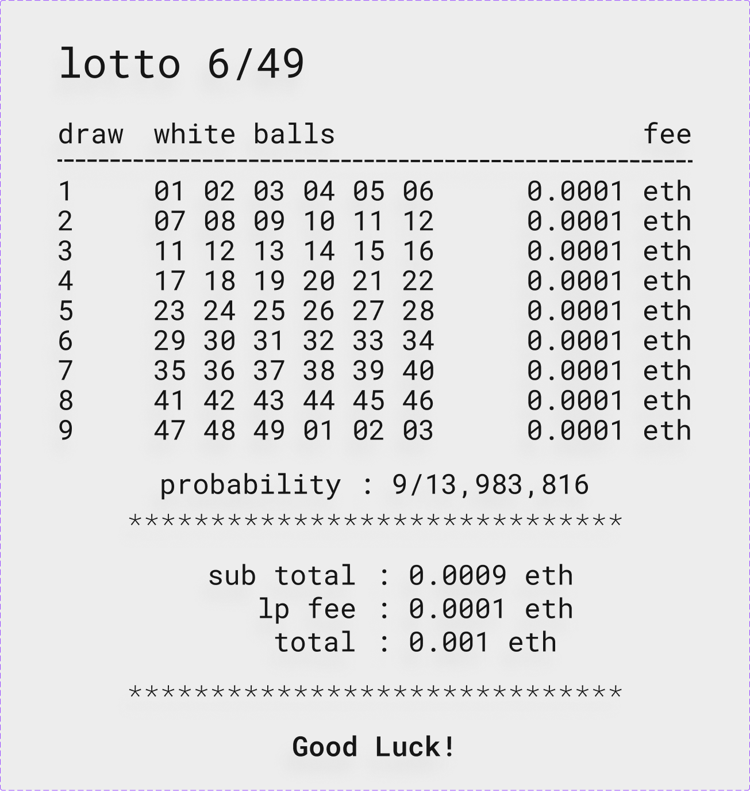

# Lotto Hook

A Uniswap v4 hook that allows a pool to use its liquidity for a 6/49 Lotto played by token holders and LPs

## Core Logic

- LPs use their liquidity between Lotto winnings and normal swaps, earning shared fees from both
- Token holders use swaps to participate in a 6/49 Lotto

## Hooks Features

- [x] `Dynamic Fee Hook` - pays for Lotto balls, and adds liquidity to Jackpot pool
- [x] `beforeInitialize()` - checks if pool supports dynamic fees
- [ ] `beforeAddLiquidity()` - check if LP wants to play house in Lottery
- [ ] `afterAddLiquidity()` - update LP lottery stake
- [ ] `beforeRemoveLiquidity()` - checks for LP Lottery participation
- [ ] `beforeSwap()` - check is swapper is creating a Lottery Draw
- [ ] `afterSwap()` - completes swap and lottery draw logic

## Lotto Draw

Lotto draw Sample

> 

## 'Good luck!'
